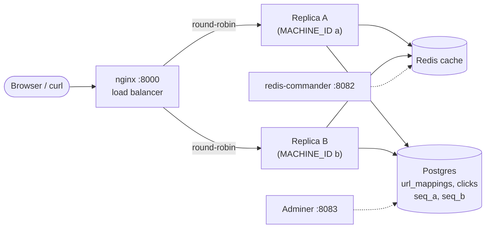
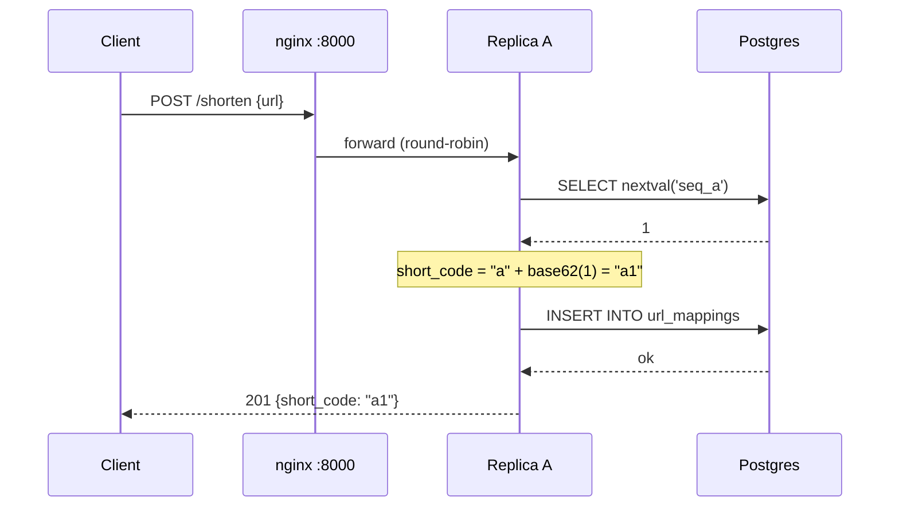
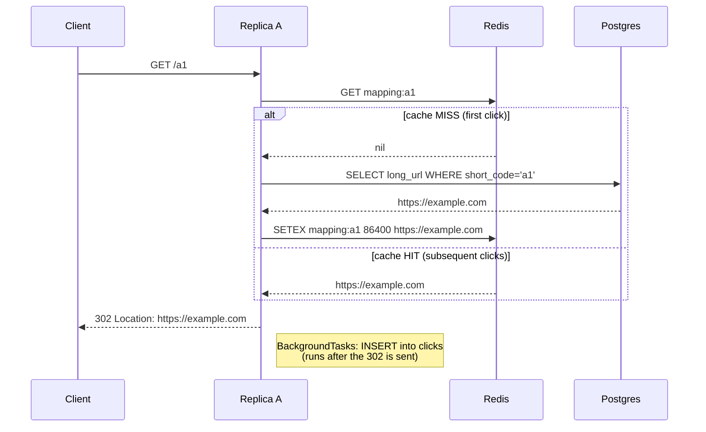

# url-shortener

[](https://github.com/gordonw1271/url-shortener/actions/workflows/ci.yml)

[](LICENSE)

A URL shortener built incrementally as a system-design study. Each phase
adds one concept from the
[System Design School URL shortener solution](https://systemdesignschool.io/problems/url-shortener/solution),
documented so the *why* is reviewable from the README.

| Phase | Status | Adds |
|---|---|---|
| 1. MVP | ✅ done | FastAPI + SQLite, base62 counter encoding |
| 2. Analytics split | ✅ done | Separate `clicks` table, fire-and-forget writes on redirect |
| 3. Cache | ✅ done | Redis read-through cache, graceful degradation |
| 4. Sharding sim | ✅ done | Postgres + machine-ID prefix, two app replicas behind nginx |
| **5. Polish** | ✅ current | Dockerfile, pytest, ruff, GitHub Actions CI, architecture diagrams |

## Architecture

### Component diagram



### Write path — `POST /shorten`



### Read path — `GET /a1` (cache HIT vs MISS)



## What's here

- `POST /shorten` — mints a short code prefixed with this instance's `MACHINE_ID`
- `GET /{short_code}` — Redis read-through → Postgres on miss → 302 redirect → background click write
- `GET /stats/{short_code}` — total clicks + 10 most recent (timestamp, IP, user-agent, referer)
- **Postgres** holds `url_mappings`, `clicks`, and per-machine `seq_<id>` sequences
- **Redis** caches `mapping:<code>` → long URL with 1-day TTL
- **nginx** on port 8000 round-robins POSTs across two `uvicorn` instances
- Test suite (`pytest`) with 38 tests against a real Postgres + fakeredis
- `ruff` lint + GitHub Actions CI on every push

## Run it

### Quick start (full stack — everything in Docker)

```bash
docker compose up --build
```

That's it. Five containers + two app replicas come up. Open <http://localhost:8000/docs> and POST a URL to `/shorten` — you'll see codes alternate between `a` and `b` prefixes as nginx round-robins.

### Dev mode (uvicorn on host, infra in Docker)

For fast iteration with `--reload`, run the app on the host and the rest in Docker:

```bash
python -m venv .venv
.venv\Scripts\activate              # Windows  (use `source .venv/bin/activate` on macOS/Linux)
pip install -r requirements-dev.txt

docker compose -f docker-compose.dev.yml up -d
```

Two more terminals:
```bash
# instance "a" on port 8001  (Windows cmd)
set MACHINE_ID=a&& uvicorn app.main:app --reload --port 8001

# instance "b" on port 8002
set MACHINE_ID=b&& uvicorn app.main:app --reload --port 8002
```

### URLs

| URL | What it is |
|---|---|
| <http://localhost:8000/docs> | API via nginx (round-robins between A and B) |
| <http://localhost:8082> | redis-commander (cache visualizer) |
| <http://localhost:8083> | Adminer (Postgres viewer — server `postgres`, user/pwd/db all `shortener`) |

## Testing

```bash
pip install -r requirements-dev.txt
docker compose -f docker-compose.dev.yml up -d   # need real Postgres + Redis
pytest -v
ruff check app tests
```

The test suite covers the base62 encoder, the cache module's graceful
degradation, and the full HTTP API (TestClient against a real Postgres
test database, with `fakeredis` substituted for Redis). CI runs both on
every push to `main` and every PR.

## Try it

1. POST a URL through <http://localhost:8000/shorten> a few times. Watch the
   short codes alternate prefixes — `a1`, `b1`, `a2`, `b2`, ... — proving
   nginx round-robins and each instance pulls from its own counter.
2. In Adminer, browse `url_mappings` to see all rows in one Postgres DB,
   and run `SELECT * FROM pg_sequences` to see `seq_a` and `seq_b`.
3. Hit a short URL through nginx (`http://localhost:8000/<code>`) — either
   replica can serve it. The first hit logs a `cache MISS` and populates
   Redis; subsequent hits are `cache HIT` and never touch Postgres.
4. Stop one of the uvicorn instances. Keep hitting nginx. Requests still
   succeed (nginx routes around the dead upstream).

## Design choices

<details>
<summary>(click to expand)</summary>

**(Phase 1) Base62 counter encoding.** A counter (auto-increment in Phase 1,
per-machine sequence in Phase 4) is encoded into a URL-safe alphanumeric
string. Collision-free by construction — no hash collisions to handle, no
retry loops. Tradeoff: short codes are sequential and guessable, which leaks
how many URLs you've shortened.

**(Phase 1) 302 instead of 301 redirects.** A 301 (permanent) is cached
aggressively by browsers, so subsequent clicks bypass the server. We need
every click to reach us so the analytics row gets written. 302 is non-cached.

**(Phase 1) FastAPI + SQLAlchemy + SQLite.** FastAPI gives auto-generated
Swagger UI at `/docs` so you can hand-drive every endpoint. SQLAlchemy keeps
the ORM code identical when the connection string swaps from SQLite to
Postgres in Phase 4.

**(Phase 2) Separate `clicks` table.** Redirects are read-heavy, analytics
are write-heavy. Splitting them means a redirect's INSERT goes to a
different table from the SELECT — no row-level contention, and we can scale
them independently later.

**(Phase 2) Fire-and-forget click writes.** The redirect handler returns
the 302 *before* the click row is written. FastAPI's `BackgroundTasks`
schedules the INSERT to run after the response is sent. Tradeoff: a crash
between response and INSERT loses one click. Acceptable for analytics;
unacceptable for billing.

**(Phase 3) Read-through Redis cache.** Redirect handler asks Redis first
(`mapping:{code}` → long URL). On miss it reads Postgres and populates the
cache. Mappings are immutable, so no invalidation needed — we still set a
1-day TTL to evict cold entries.

**(Phase 3) Graceful degradation.** Every Redis call is wrapped in
try/except. If Redis is down, latency degrades but the app keeps working.
Cache is an optimization, never a hard dependency.

**(Phase 3) Read-through, not write-through.** We don't pre-populate the
cache when a URL is shortened — only when it's first *clicked*. Most
shortened URLs are never clicked, so write-through wastes memory.

**(Phase 4) Machine-ID prefix.** Each instance has a single-character
`MACHINE_ID` (`a`, `b`, ...). Short codes are `MACHINE_ID + base62(seq)`,
where `seq` comes from a Postgres `SEQUENCE` named per machine
(`seq_a`, `seq_b`). Two writers mint codes in disjoint keyspaces — no
distributed lock, no central counter. The prefix also doubles as a
"shard key": in real systems with physically separate DBs, the first
character of the short code tells you which shard owns it.

**(Phase 4) nginx round-robin.** A single entrypoint on port 8000 spreads
load across both replicas. Either replica can serve any GET because they
share Postgres + Redis (logical sharding — physical sharding would split
the DB by prefix, kept as a future exercise).

**(Phase 5) Tests against a real Postgres.** CI uses GitHub Actions service
containers; locally, the test suite expects `docker-compose.dev.yml` to be
running. Tests substitute `fakeredis` for Redis but use a real Postgres
test database (`shortener_test`, created on demand by `conftest.py`) so the
`SEQUENCE` logic is exercised.

</details>

## Project structure

```
.
├── app/                  FastAPI app (encoding, db, cache, models, schemas, main)
├── tests/                pytest suite (encoder, cache, API)
├── .github/workflows/    CI pipeline (ruff + pytest)
├── Dockerfile            multi-stage build for the app
├── docker-compose.yml    full stack (apps + infra)
├── docker-compose.dev.yml infra only — for host-uvicorn dev mode
├── nginx.conf            full-stack upstream (app-a:8000, app-b:8000)
├── nginx.dev.conf        dev-mode upstream (host.docker.internal:8001/8002)
├── pyproject.toml        pytest + ruff config
├── requirements.txt      runtime deps
└── requirements-dev.txt  + pytest, ruff, fakeredis
```
